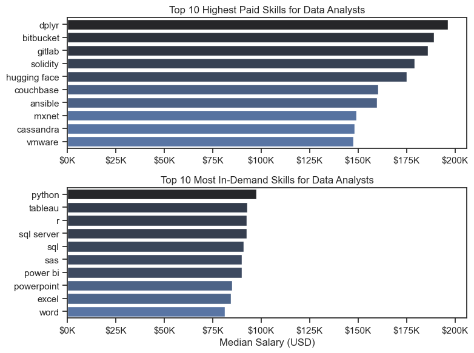
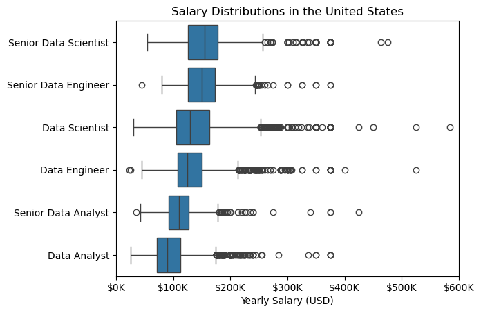

---
# Project Overview

This project analyzes the **data job market**, with a main focus on **Data Analyst roles**.  
The goal of this analysis is to understand which skills are **most in demand**, which skills **offer higher salaries**, and what skills **data analysts should learn to improve their career opportunities**.

By exploring job market data, this project helps identify important trends in the data industry, including **salary distributions, skill demand, and high-paying technologies**.

The dataset used in this project comes from **Luke Barousse's Python Data Analytics Course**, which includes detailed information about:

- Job titles  
- Salaries  
- Job locations  
- Required technical skills  

Using **Python for data analysis**, I explored the dataset to answer important questions related to the data analyst job market.


---

#  Key Questions Explored

This project focuses on answering the following questions:

1. **What are the most in-demand skills for the top 3 data roles?**  
   (Data Analyst, Data Scientist, and Data Engineer)

2. **How are in-demand skills trending for Data Analysts?**  
   This helps identify which skills are becoming more important over time.

3. **Which skills are associated with higher salaries for Data Analysts?**  
   Understanding this helps professionals focus on high-value skills.

4. **What are the optimal skills for Data Analysts to learn?**  
   The goal is to identify skills that are both:
   - **High in demand**
   - **High paying**

---

#  Project Objective

The main objective of this project is to help aspiring and current **Data Analysts** understand:

- Which **skills are most valuable in the job market**
- Which skills can lead to **higher salaries**
- What technologies are **currently trending in the industry**

This analysis can help guide **learning paths, career decisions, and skill development** for people interested in working in data analytics.

---
#  Tools I Used

To analyze the **Data Analyst job market**, I used several important tools and technologies.

### Python
Python was the main programming language used for this project. It helped me clean the data, perform analysis, and generate insights about the job market.

I used the following Python libraries:

- **Pandas**  
  Used for data cleaning, transformation, and analysis.

- **Matplotlib**  
  Used to create basic data visualizations.

- **Seaborn**  
  Used to create more advanced and visually appealing charts.

### Jupyter Notebook
Jupyter Notebook was used to run the Python code and document the analysis step by step. It allows combining **code, explanations, and visualizations** in one place.

### Visual Studio Code
Visual Studio Code was used as the main **code editor** to manage and run Python scripts and notebooks.

### Git & GitHub
Git and GitHub were used for **version control and project management**, allowing me to track changes and share the project online.

---

#  Data Preparation and Cleaning

Before starting the analysis, the dataset needed to be cleaned and prepared to ensure accurate results.

The following steps were performed:

- Imported the required Python libraries
- Loaded the dataset
- Removed missing salary values
- Filtered data by job role and location
- Prepared the data for analysis and visualization

These steps ensured that the dataset was **clean, structured, and ready for analysis**.

---

#  Import and Clean Data

The analysis begins by importing the necessary Python libraries and loading the dataset.  
After loading the data, initial cleaning steps are performed to prepare the dataset for further analysis.

This includes handling missing values and selecting relevant columns required for the project.


---
#   The Analysis
###   Most demanded skills for the top three popular data roles?

To find the most demanded skills for the top three data roles, I first identified which jobs are the most popular. Then I selected the top five skills required for each of these roles.

This analysis shows the most common job titles and their key skills, helping me understand which skills I should focus on learning depending on the role I want to pursue.

You can view my notebook with the detailed steps here:
[2_Skill.ipynb](3_Project_overview/2_Skill.ipynb).

### Visualize data
```Python
fig, ax = plt.subplots(len(job_titles), 1)

sns.set_theme(style='ticks')

for i, job_title in enumerate(job_titles):

    df_plot = df_skills_perc[
        df_skills_perc['job_title_short'] == job_title
    ].head(5)

    sns.barplot(
        data=df_plot,
        x='skill_percentage',
        y='job_skills',
        ax=ax[i],
        hue='skill_count',
        palette='dark:b_r'
    )

    ax[i].set_title(job_title)
    ax[i].set_ylabel('')
    ax[i].set_xlabel('')
    ax[i].get_legend().remove()
    ax[i].set_xlim(0, 78)

    for n, v in enumerate(df_plot['skill_percentage']):
        ax[i].text(v + 1, n, f'{v:.0f}%', va='center')

    if i != len(job_titles) - 1:
        ax[i].set_xticks([])

fig.suptitle('Likelihood of Skills Requested in US Job Postings', fontsize=15)
fig.tight_layout(h_pad=0.5)  #  overlap
plt.show()
```

### Result
Most demanding jobs


*Visualization based on skills in different role*

---
#  Data Analyst Skills: Salary vs Demand

This project shows the difference between highest paid skills and most in-demand skills for data analysts.

## Top 10 Highest Paid Skills

The first chart shows the skills that give the highest median salary.
Some of these skills are dplyr, Bitbucket, GitLab, Solidity, Hugging Face, Couchbase, and Ansible.

These skills can give higher salaries (around $150K–$200K), but they are not always required in many data analyst jobs because they are more specialized tools.

## Top 10 Most In-Demand Skills

The second chart shows the skills that appear most often in data analyst job postings.

Some of the most common skills are Python, Tableau, R, SQL Server, SQL, Power BI, Excel, and PowerPoint.

These are basic and important skills that most companies expect from a data analyst.

Check the whole in here along with diffrent style visualized charts:[20_Seaborn_intro.ipynb](2_Advanced/20_Seaborn_intro.ipynb).

### Visualize data

```Python

sns.set_theme(style="ticks")

fig, ax = plt.subplots(2, 1, figsize=(8, 6))

# Top 10 Highest Paid Skills
sns.barplot(
    data=df_DA_top_pay,
    x='median',
    y=df_DA_top_pay.index,
    ax=ax[0],
    hue='median',
    palette='dark:b_r',
    legend=False
)

ax[0].set_title('Top 10 Highest Paid Skills for Data Analysts')
ax[0].set_ylabel('')
ax[0].set_xlabel('')
ax[0].xaxis.set_major_formatter(
    plt.FuncFormatter(lambda x, _: f'${int(x/1000)}K')
)


# Top 10 Most In-Demand Skills
sns.barplot(
    data=df_DA_skills,
    x='median',
    y=df_DA_skills.index,
    ax=ax[1],
    hue='median',
    palette='dark:b_r',
    legend=False
)

ax[1].set_title('Top 10 Most In-Demand Skills for Data Analysts')
ax[1].set_ylabel('')
ax[1].set_xlabel('Median Salary (USD)')

# Make both plots share same x-axis scale
ax[1].set_xlim(ax[0].get_xlim())

ax[1].xaxis.set_major_formatter(
    plt.FuncFormatter(lambda x, _: f'${int(x/1000)}K')
)

plt.tight_layout()
plt.show()

```

### Result


*Visualization on top paid skills and top demanded skills*

---
# Key Insights

1. Python Dominates Technical Roles
Python is one of the most important programming languages in the data field. It is required across all three roles — Data Analyst, Data Scientist, and Data Engineer. However, the demand is highest for Data Scientists (72%) and Data Engineers (65%), showing its strong importance in advanced data work as shown in [2_Skill.ipynb](3_Project_overview/2_Skill.ipynb).

2. SQL is Essential for Data Analysis
SQL is the most commonly requested skill for Data Analysts and Data Scientists. It appears in more than 50% of job postings, highlighting the importance of database querying and data extraction in these roles.

3. Python is Critical for Data Engineering
For Data Engineers, Python appears in 68% of job postings, making it the most demanded skill. This reflects the role of Python in data pipeline development, automation, and large-scale data processing.

4. Core Skill Foundation in Data Careers
Overall, Python and SQL form the core skill foundation across most data-related roles, while the specific tools vary depending on the responsibilities of each role.


---
# Trending Top Skills for Data Analysts in the US (2023)

 **monthly trend of the top 5 most demanded skills for Data Analysts in the United States during 2023**. The percentages represent the **likelihood of a skill appearing in job postings** each month. [3_Skill_trend.ipynb](3_Skill_trend.ipynb)


### Key Insights

* **SQL** is the most consistently requested skill throughout the year, appearing in **over 50% of job postings** every month. This highlights its importance as a core skill for data analysts.

* **Excel** remains the **second most demanded skill**, with demand staying around **40–45%** for most of the year. This indicates that spreadsheet-based analysis is still widely used in many organizations.

* **Python** shows **moderate demand** and experiences a noticeable increase toward the **end of the year**, suggesting growing interest in programming-based data analysis.

* **Tableau** maintains **steady demand**, typically appearing in about **30–35% of job postings**, emphasizing the importance of data visualization and dashboarding skills.

* **Power BI** has the **lowest demand among the five skills**, but it remains consistently present in around **20–23% of postings**, reflecting its continued use in business intelligence workflows.

### Overall Trend

The chart shows that **data analysis roles require a combination of database querying, spreadsheet analysis, programming, and visualization tools**. SQL and Excel dominate the market, while tools like Python, Tableau, and Power BI complement analytical workflows.

### Skills Covered in the Analysis

* SQL
* Excel
* Python
* Tableau
* Power BI


### Visualize data
```Python
df_plot = df_DA_US_percent.iloc[:, :5]

sns.set_theme(style='ticks')
sns.lineplot(data=df_plot, dashes=False, palette='tab10')
sns.despine()

plt.title('Trending Top Skills for Data Analysts in the US')
plt.ylabel('Likelihood in Job Posting')
plt.xlabel('2023')
plt.legend().remove()

from matplotlib.ticker import PercentFormatter

ax = plt.gca()
ax.yaxis.set_major_formatter(PercentFormatter(decimals=0))

for i in range(5):
    plt.text(11.2, df_plot.iloc[-1, i], df_plot.columns[i])

```


### Result


*Bar graph visualization on trending skill*

---    
# Salary Distribution Analysis (United States)

This visualization shows the salary distribution of the top 6 most common data-related job roles in the United States. A boxplot was used to analyze the spread, median, and outliers of yearly salaries.

## Key Findings

### 1️.  Senior Data Scientist

Highest salary distribution among all roles.

Most salaries range between $150K – $200K.

Several outliers exceed $400K, indicating highly paid specialized positions.

### 2️. Senior Data Engineer

Salaries typically fall between $140K – $190K.

Shows a strong upper salary range compared to non-senior roles.

### 3️.  Data Scientist

Median salaries around $130K – $160K.

Some extreme outliers reach above $500K, possibly due to senior responsibilities or large tech companies.

### 4️.  Data Engineer

Salaries generally range from $110K – $160K.

Similar distribution to Data Scientist but slightly lower median.

### 5️.  Senior Data Analyst

Salary range mostly between $100K – $140K.

Higher than standard analyst roles due to experience and leadership responsibilities.

### 6️.  Data Analyst

Lowest salary range among the roles.

Most salaries fall between $80K – $120K.

---
# Overall Insights

Senior roles consistently offer higher salaries than non-senior positions.

Data Scientist and Data Engineer roles tend to have higher salary ranges compared to Data Analyst roles.

The presence of multiple outliers indicates high-paying opportunities in specialized positions or top tech companies.


You can view my notebook with the detailed steps here:  
[4_Salary_analysis.ipynb](4_Salary_analysis.ipynb)

### Visualize data

```Python
sns.boxplot(data=df_US_top6, x='salary_year_avg', y='job_title_short', order =job_order)

plt.title('Salary Distributions in the United States')
plt.xlabel('Yearly Salary (USD)')
plt.ylabel('')

plt.xlim(0, 600000)

ax = plt.gca()

ticks_x = plt.FuncFormatter(lambda x, pos: f'${int(x/1000)}K')
ax.xaxis.set_major_formatter(ticks_x)

plt.show()
```

### Result



*Salary analysis visualization based on roles*

---
#  What I Learned

Through this project, I improved my understanding of the **Data Analyst job market** and strengthened my technical skills in **Python and data analysis**.  
Below are some key things I learned during this analysis:

### 1. Advanced Python for Data Analysis
I improved my ability to use Python libraries such as:
- **Pandas** for data cleaning and manipulation
- **Matplotlib** for basic data visualization
- **Seaborn** for more advanced and statistical visualizations

These tools helped me analyze large datasets and extract meaningful insights.

### 2. Importance of Data Cleaning
I learned that **data cleaning and preparation are essential steps before any analysis**.  
Handling missing values and organizing the data properly ensures that the analysis results are accurate and reliable.

### 3. Understanding Market Demand
This project helped me understand the relationship between:
- **Skills**
- **Salary**
- **Job demand**

By analyzing these factors together, it becomes easier to identify which skills are **most valuable for Data Analysts in the job market**.

### 4. Data Visualization for Insights
Creating visualizations made it easier to understand patterns in the data, such as:
- Salary distributions
- Most demanded skills
- Skill trends in the industry
---
# Key Insights

This project provided several important insights into the **Data Analyst job market**:

### Skill Demand and Salary
There is a strong relationship between **in-demand skills and higher salaries**.  
Technical skills such as **Python, SQL, and other specialized tools** often lead to better salary opportunities.

### Changing Market Trends
The demand for skills in the data industry continues to evolve.  
Staying updated with trending tools and technologies is important for long-term career growth in data analytics.

### Value of High-Demand Skills
Skills that are both **high in demand and well paid** are especially valuable for data analysts.  
Learning these skills can significantly improve job opportunities and career progression.

---

# Challenges I Faced

During this project, I faced several challenges that helped improve my analytical and problem-solving skills.

### Data Inconsistencies
Some records contained **missing or incomplete data**, which required careful cleaning and preparation before analysis.

### Complex Data Visualization
Creating clear and meaningful visualizations from large datasets was sometimes challenging.  
It required experimenting with different charts and visualization techniques.

### Balancing Depth of Analysis
Deciding how deeply to analyze each topic while maintaining a **clear overview of the job market trends** required careful planning.

---
# Conclusion

This project explored the **Data Analyst job market** to understand the most in-demand skills, salary trends, and important technologies used in the industry.

Through this analysis, I identified key skills that are both **highly demanded and well paid**, which can help aspiring data analysts focus on learning the most valuable tools and technologies.

The project also improved my understanding of **data analysis, data cleaning, and data visualization using Python**.

As the data industry continues to evolve, staying updated with new tools and skill trends will be important for career growth. This project provides a strong foundation for further exploration of the data job market and highlights the importance of **continuous learning in the field of data analytics**.