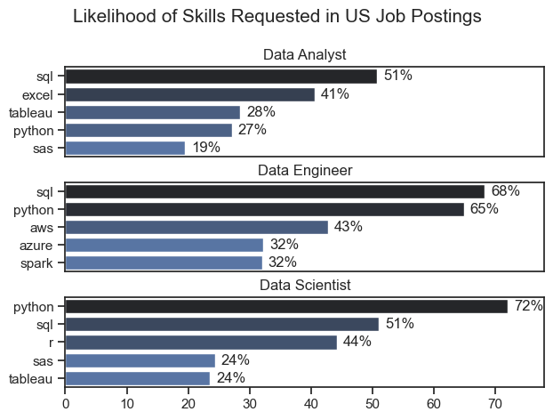

# The Analysis
## 1. What are the most demanded skills for the top 3 popular data roles?

To find the most demanded skills for the top three data roles, I first identified which jobs are the most popular. Then I selected the top five skills required for each of these roles.

This analysis shows the most common job titles and their key skills, helping me understand which skills I should focus on learning depending on the role I want to pursue.

You can view my notebook with the detailed steps here:
[2_Skill.ipynb](3_Project_overview/2_Skill.ipynb).

### Visualize data
```Python
fig, ax = plt.subplots(len(job_titles), 1)

sns.set_theme(style='ticks')

for i, job_title in enumerate(job_titles):

    df_plot = df_skills_perc[
        df_skills_perc['job_title_short'] == job_title
    ].head(5)

    sns.barplot(
        data=df_plot,
        x='skill_percentage',
        y='job_skills',
        ax=ax[i],
        hue='skill_count',
        palette='dark:b_r'
    )

    ax[i].set_title(job_title)
    ax[i].set_ylabel('')
    ax[i].set_xlabel('')
    ax[i].get_legend().remove()
    ax[i].set_xlim(0, 78)

    for n, v in enumerate(df_plot['skill_percentage']):
        ax[i].text(v + 1, n, f'{v:.0f}%', va='center')

    if i != len(job_titles) - 1:
        ax[i].set_xticks([])

fig.suptitle('Likelihood of Skills Requested in US Job Postings', fontsize=15)
fig.tight_layout(h_pad=0.5)  # fix the overlap
plt.show()
```

### Result
Most demanding jobs

